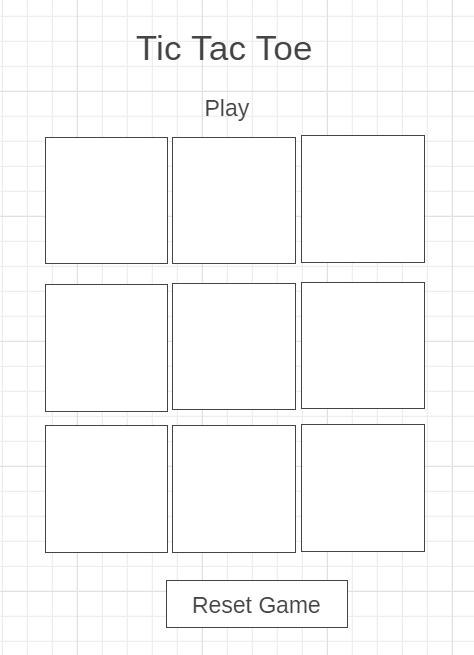

# TicTacToe

- This is a simple game which has created by JavaScript  
for two players  .
##### [click here to play the game](https://enghuda.github.io/Tic-Tac-Toe/)

### Technologies:
- HTML5
- CSS
- JavaScript
- DOM

### Link to wireframes:
- 

### Something to add :
- Allow 2 players to play online with each other 
- Add more themes.

### How it works:
- The user choose X or O and clicks on a box if their clicks in a horizontal, vertical, or diagonal will wins the game.

